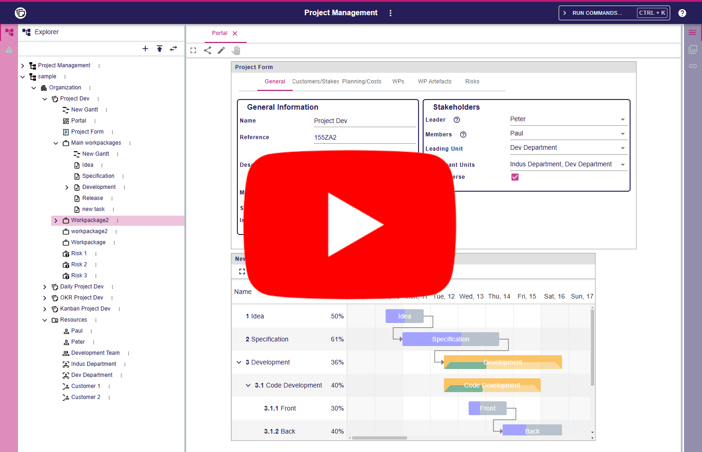

= Pepper

Pepper stands for "Plan Progress Review", a project management tool.

Here is a video showing quick overview of what can be done with pepper. Click to open Youtube.

[#video-pepper,link=https://www.youtube.com/watch?v=j81UG2FyNCQ]

Pepper is a web application based on https://www.eclipse.org/sirius/sirius-web.html[Eclipse Sirius-Web].

It allows to create data related to your project and represents the data with Gantt, Form and boards like Daily, Kanban or OKR.

Follow the links below for more informations :

* https://github.com/ObeoNetwork/pepper/blob/main/doc/user.adoc[User documentation] 
* https://blog.obeosoft.com/pepper-a-case-of-open-innovation-with-sirius-web[Blog post presenting Pepper]

= Starting with Pepper

This repository is a mono repo containing both frontend and backend components.

To test _Pepper_ you have two possible options:

. If you just want to run an already built version of the example application, follow link:#quick-start[the Quick Start].
. If you want to _build_ the application yourself, follow link:#build[the complete Build instructions].

[#quick-start]
== Quick Start

If you want a quick overview of how Pepper looks and feels like without building the sample application yourself, you will simply need:

* Java 17
* Docker, or an existing PostgreSQL 12 (or later) installation with a DB user that has admin rights on the database (those are needed by the application to create its schema on first startup).

To actually run the application:

1. Pepper uses PostgreSQL for its database. For development or local testing, the easiest way is to start a PostgreSQL instance using Docker.
+
[#docker-db, reftext=Docker command]
[source,sh]
----
docker run -p 5439:5432 --name pepper-postgres \
                            -e POSTGRES_USER=dbuser \
                            -e POSTGRES_PASSWORD=dbpwd \
                            -e POSTGRES_DB=pepper-db \
                            -d postgres
----
+
If you do not have Docker or want to use an existing PostgreSQL installation, adjust the command-line parameters below and make sure the DB user has admin rights on the database; they are needed to automatically create the DB schema.

2. Start the application:
+
Get the `deeplab-application-{$version}.jar` from the last successful build on https://github.com/ObeoNetwork/pepper[pepper github]
+
[source,sh]
----
java -jar deeplab-application-{$version}.jar \
          --spring.datasource.url=jdbc:postgresql://localhost:5439/pepper-db \
          --spring.datasource.username=dbuser \
          --spring.datasource.password=dbpwd
----

3. Point your browser at http://localhost:8080 and enjoy!
+
WARNING: The initial version of Pepper has some known issues with Firefox.
It is recommended to use a Chrome-based browser until these are fixed.
+
NOTE: Do not forget to stop the PostgreSQL container once you are done: `docker stop pepper-postgres`.

[#build]
== Building

[#build-requirements]
=== Requirements

To build the application yourself you will need the following tools:

* Git, and a GitHub account
* To build the backend components:
** https://adoptium.net/temurin/releases/[Java 17]
** https://archive.apache.org/dist/maven/maven-3/3.6.3/binaries/[Apache Maven 3.6.3]
** https://www.docker.com/[Docker] must be installed and running for some of the backend components tests to run.
* To build the frontend components:
** LTS versions of https://nodejs.org/[Node and NPM]: in particular, Node >= 18.7.0 is required along with npm >= 8.15.0.

WARNING: Note that there are issues with npm under Windows Subsystem for Linux (WSL). If you use WSL and encounter error messages like _"Maximum call stack size exceeded"_ when running NPM, switch to plain Windows where this should work.

For Windows users: Due to the Maximum Path Length Limitation of Windows, you may exceed the limit of 260 characters in your PATH. To remove this limitation, apply https://learn.microsoft.com/en-us/windows/win32/fileio/maximum-file-path-limitation?tabs=powershell[this procedure] with this command line in PowerShell (`New-ItemProperty -Path "HKLM:\SYSTEM\CurrentControlSet\Control\FileSystem" -Name "LongPathsEnabled" -Value 1 -PropertyType DWORD -Force`), then active the longpath option in Git in a command line with administrator rights (`git config --system core.longpaths true`).

[#github-token]
=== GitHub Access Token

The backend of _Pepper_ depends on https://github.com/eclipse-sirius/sirius-emf-json[`sirius-emf-json`] and https://github.com/eclipse-sirius/sirius-web[`sirius-web`], which is published as Maven artifacts in _GitHub Packages_.
To build `pepper` locally, you need a _GitHub Access Token_ so that Maven can download the artifacts.

. Create a personal token with a scope of `read:package` by following https://docs.github.com/en/authentication/keeping-your-account-and-data-secure/creating-a-personal-access-token#creating-a-personal-access-token-classic[the GitHub documentation] if you do not have one already.
+
WARNING: Once generated, a token cannot be displayed anymore, so make sure to copy it in a secure location.
. Create or edit `$HOME/.m2/settings.xml` to tell Maven to use this token when accessing the Sirius EMF JSON repository:
+
[source,xml]
----
<?xml version="1.0" encoding="UTF-8"?>
<settings xmlns="http://maven.apache.org/SETTINGS/1.0.0"
          xmlns:xsi="http://www.w3.org/2001/XMLSchema-instance"
          xsi:schemaLocation="http://maven.apache.org/SETTINGS/1.0.0 https://maven.apache.org/xsd/settings-1.0.0.xsd">
  <servers>
    <server>
      <id>github-sirius-emfjson</id>
      <username>$GITHUB_USERNAME</username>
      <password>$GITHUB_ACCESS_TOKEN</password>
    </server>
    <server>
      <id>github-sirius-web</id>
      <username>$GITHUB_USERNAME</username>
      <password>$GITHUB_ACCESS_TOKEN</password>
    </server>
  </servers>
</settings>
----
+
Be sure to replace `$GITHUB_USERNAME` with your GitHub user id, and `$GITHUB_ACCESS_TOKEN` with the value of your acess token done in the previous step.
+
IMPORTANT: The `id` used in your `settings.xml` *must* be the ones mentioned above to match what is used in the POMs.
. Create or edit `$HOME/.npmrc` and add the following line:
+
[source,plaintext]
----
//npm.pkg.github.com/:_authToken=$GITHUB_ACCESS_TOKEN
----
+
Again, be sure to replace `$GITHUB_ACCESS_TOKEN` with the value of your access token.

[#build-steps]
=== Build Pepper application

Build steps:

. Clone the Pepper repository https://github.com/ObeoNetwork/pepper[pepper]

. Build the frontend ([.small]#from the `frontend` subfolder of Pepper main location#):
+
[source,sh]
----
npm ci
npm run build
----

NOTE: In case of npm ERR! Lifecycle script `format-lint` failed with error, try to run from the frontend subfolder the following command: 
`npx prettier --write .` (don't forget the final dot)

. Install the frontend artifacts as static resource to be served by the backend. From the root directory of the repository:
+
[source,sh]
----
mkdir -p backend/deeplab-frontend/src/main/resources/static
cp -R frontend/deeplab-web/dist/* backend/deeplab-frontend/src/main/resources/static
----

. Build the backend ([.small]#from the `backend` subfolder of Pepper main location#):
+
[source,sh]
----
mvn clean verify
----
+
The result is a ready-to-run, Spring Boot "fat JAR" in backend/deeplab-application/target/deeplab-application-<VERSION>.jar. Refer to the instructions in the "Quick Start" section above to launch it.

[Dev-env]
=== Development environment
Here are instructions that new Pepper developer could follow in order to set up the development environment.

[NOTE]
=====
The set up of the Github token is required for setting up back end and front (see <<github-token>>)
=====

==== Backend set up

. Download your preferred Java IDE

. Clone Pepper repositories: https://github.com/ObeoNetwork/pepper[pepper] repository

. Import Pepper projects in workspace

. For windows users, please set your git configuration to:

* git config core.autocrlf true
* git config core.eol lf
* git config user.name "$FirstName $ SecondName"
* git config user.email "$email"

. Set up your IDE with

** Checkstyle configuration.
+
[source]
----
backend/deeplab-resources/checkstyle/CheckstyleConfiguration.xml
----

** Editor configurations
+
[source]
----
backend/deeplab-resources/editor
----

[#backend-launch-config, reftext=Launch configuration]
[start=6]
.  Create Launch Configuration for Pepper server
* Start the server with `DeeplabWeb.java` class.
* For debugging, add the following environment variable `spring.profiles.active=dev`

==== Frontend set up

. Open the `frontend` folder in VSCode
. Install dependencies using `npm install` in the terminal

==== Launch Application as a developer 

. Run database docker image (see <<docker-db>>)
. Launch backend from your Java IDE (see <<backend-launch-config>>)
. Launch frontend `npm start`

== License

Everything in this repository is Open Source. Except when explicitly mentioned otherwise (e.g. for some resources likes images), the license is Eclipse Public License v 2.0.

